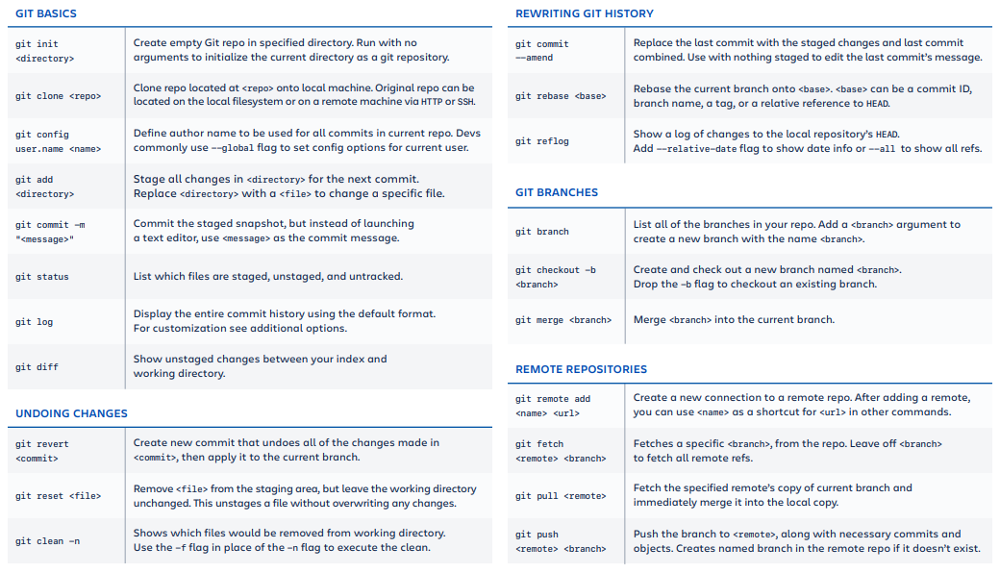
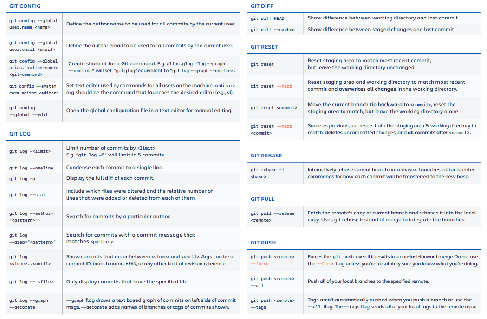

# homnaydocgi-server

## Node version: 14.4.0

## Install packages: yarn or npm install

## Run app:

- Restart on changes: yarn dev
- Without restart on changes: yarn start

## Formating Code: yarn format

## Git cheat sheet

